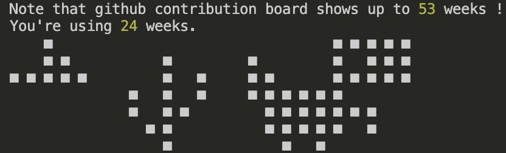

# CommitArt

Transform the GitHub Contributions Graph into something amazing, fun, and beautiful (if you want).

## Introduction

This repository is the `painter` and will add commits inside another one. So you need to create a `canvas` repository; public or private, it doesn't matter. Just make sure to show your private contributions if you choose to have a private canvas repository.

The advantage of using a separate `canvas` repository is that you don't need to delete this one if you want to remove your drawing; you can just delete the canvas.

## Motivations

I saw a famous GitHub contributor who wrote "I <3 DevTools" on his contribution board, and I was really inspired by it. I wanted to give this tool to the community to make your own contribution board more customizable and fun. Let's draw something now!

## Installation

Node >= 20

Run `npm install`.

If you want to start your drawing in the past, you will need to have `Docker` installed and run `docker-compose up -d` to launch the VM. We need a VM here because we need to manipulate the date on the machine to trick the commit dates. See below for detailed instructions to start drawing in the past.

## Requirements

- [Fork this repository](https://github.com/dlepaux/commit-art/fork) to have it in your namespace.
- [Create a new repository](https://github.com/new). You can name it: `commit-art-canvas`.
  - Add deploy keys to the canvas repository (with **Allow write access**). I suggest you follow [this guide](https://docs.github.com/en/authentication/connecting-to-github-with-ssh/managing-deploy-keys) and create the SSH keys inside the VM and save them.

## Configuration

### Environment Variables
You need to create a `.env` file from the `.env-example` and fill in the variables.

You also need to create and fill in the same variables as Repository Secrets on GitHub to run the daily drawing check with GitHub Actions.

**Notes about the configuration**

We need to have your minimal GitHub information to make the commits; otherwise, Git will not allow commits.

We need to have an SSH key to allow read/write access to the canvas repository for proper commits.

### Local Configuration

See the `config.ts` file at the root of the project directory. You have a couple of important things to set up before continuing! Once done, you can come back here.

## Instructions

Obviously, the first thing you need here is to have your drawing ready. See below for detailed information about how it works behind the scenes.

### Draw in the Past

You need to start Docker and execute `docker-compose up -d`. Then go to the terminal and simply execute `npm run setup`. This command will set the date of the VM to a past date and continue doing that until the drawing is finished.

### Draw Every Day

You just need to set your drawing in the `config.ts` file, and that's it. The GitHub Action will run every day automatically.

## How It Works

There are a couple of things to note here.

First, we actually do one fake commit on empty space because it normalizes the "background" of the "canvas" on the GitHub contribution board. When we need to actually draw a "pixel," we do 100 commits. If you make even more than that in a day, you might need to increase this to avoid having different "opacities."

The principle of drawing things is pretty simple. We use a matrix of 7 "pixels" high max (because we have 7 days in a week, right?).

The tool actually uses what are called `symbols` first; these are patterns that aren’t letters or simple characters to replace. Then we replace the characters individually.

So we have something like this:

```
[
  [0,0,0,0,0,1,1,1,1,1],
  [1,0,0,0,0,1,0,1,1,1],
  [1,1,0,0,0,1,1,1,1,1],
  [1,1,1,1,1,1,0,0,0,0],
  [0,1,1,1,1,1,1,1,0,0],
  [0,1,1,1,1,1,0,1,0,0],
  [0,0,1,0,1,0,0,0,0,0],
]
```

A `0` means no pixel, and a `1` means... a pixel! And so we can draw almost anything! Here is the Chrome Dinosaur.

The tool currently supports the Latin alphabet in both lower and upper cases, as well as some punctuation characters. Feel free to make a Pull Request with your own set or for any improvements!

## Tests

To test your beautiful drawing, just run `npm run print`, and you would typically see something like this:

<div>
  <p align="center">
    
  </p>
</div>
